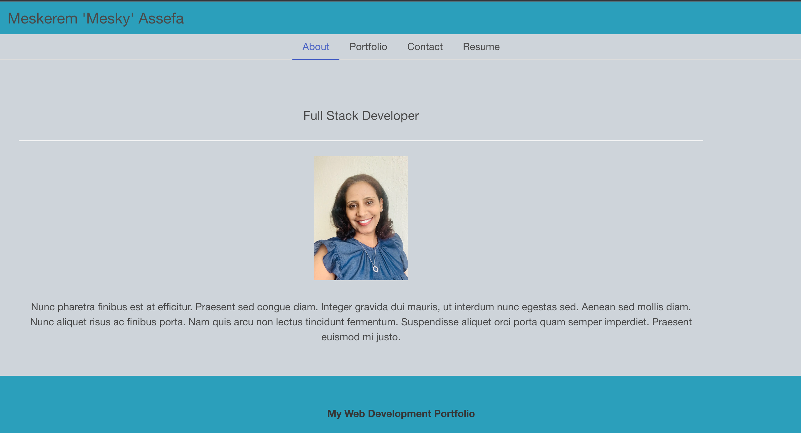

# 20 React: React Portfolio

## Your Description

This is a personal profile of myself built by using React. It is a single-page application. I included projects I worked on while attending coding bootcamp. 

## User Story

As an employer searching to an employee, I want to view a potential candidate's personal portfolio built with React. I will look for the employees skills and evaluate if qualified for a position.

## Table of Contents

- [Installation](#installation)
- [Technologies Used](#technologies)
- [Screen Shots](#screen-shots)
- [Links](#links)

## Installation

- npx create-react-app my-app
- npm i

## Technologies

- React
- CSS to style
- Coolors 
- React-Bootstrap-Icons

### Screen Shots
- 
- 
- 
- 
- 

### Links

- [Github-link](https://github.com/meskyA/react-portfolio/tree/deploy)
- [Deployed-link](https://meskya.github.io/react-portfolio/)

